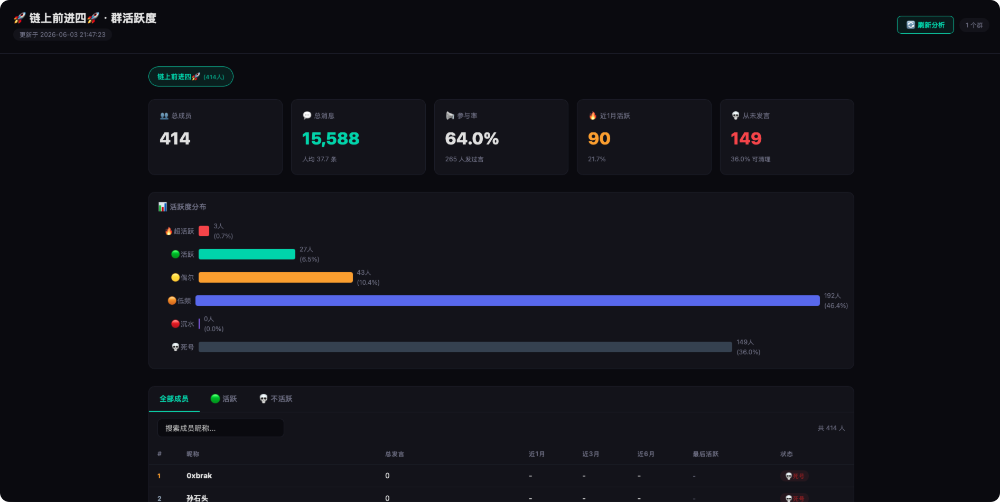

# 📊 WeChat Group Stats

> 微信群聊活跃度分析工具 — 解密本地 WeChat 数据库，统计成员发言，Web Dashboard 可视化。

基于 [ylytdeng/wechat-decrypt](https://github.com/ylytdeng/wechat-decrypt) 的解密引擎，封装了一键分析脚本 + 可视化面板。

## ✨ 功能

- 🔓 委托 wechat-decrypt 解密微信本地加密数据库
- 📊 统计每个成员的 总发言 / 近1月 / 近3月 / 近6月
- 🏷️ 智能分档：🔥超活跃 → 🟢活跃 → 🟡偶尔 → 🟠低频 → 🔴沉水 → 💀死号
- 🌐 Web Dashboard — 暗色主题、可排序、可搜索、一键刷新
- 📦 JSON 输出，可接入自动化/定时任务
- 🧠 [Hermes Agent](https://hermes-agent.nousresearch.com) Skill — 对话式引导完成全流程

## 🛠 快速开始

### 前置依赖

```bash
# 安装 wechat-decrypt（解密引擎）
git clone https://github.com/ylytdeng/wechat-decrypt.git ~/wechat-decrypt
cd ~/wechat-decrypt
python3 -m venv .venv && source .venv/bin/activate
pip install -r requirements.txt
cc -O2 -o find_all_keys_macos find_all_keys_macos.c -framework Foundation

# 重签名微信（一次性，需要退出微信）
killall WeChat
sudo codesign --force --sign - /Applications/WeChat.app
# → 重新打开微信登录
```

### 安装本工具

```bash
git clone https://github.com/punk2898/wechat-group-stats.git
cd wechat-group-stats
```

### 一键使用

```bash
# 1. 提取密钥 + 解密（需要微信正在运行）
python3 wechat-stats.py --decrypt

# 2. 列出所有群，记下群ID
python3 wechat-stats.py

# 3. 设置群名（可选）
python3 wechat-stats.py --set-name "你的群ID@chatroom" "我的群名"

# 4. 分析指定群
python3 wechat-stats.py --group "我的群名"

# 5. 打开 Dashboard
python3 wechat-server.py
# → http://localhost:8080/dashboard.html
```

### 日常使用

初次设置后，每次只需：

```bash
cd wechat-group-stats
python3 wechat-server.py
# 打开 Dashboard，点击 🔄 刷新分析
```

## 📸 Dashboard



## 📂 项目结构

```
wechat-group-stats/         ← 本项目（独立 repo）
├── wechat-stats.py         ← 分析脚本
├── wechat-server.py        ← Web 服务
├── dashboard.html          ← Dashboard
├── group-names.example.json ← 群名模板
├── README.md
└── .gitignore

~/wechat-decrypt/           ← 外部依赖（ylytdeng/wechat-decrypt）
├── find_all_keys_macos     ← 密钥提取器
├── decrypt_db.py           ← 解密脚本
└── decrypted/              ← 解密后的 SQLite 数据库
```

## 🔧 CLI 参考

```bash
python3 wechat-stats.py                           # 列出所有群
python3 wechat-stats.py --group "关键字"           # 筛选群
python3 wechat-stats.py --decrypt                 # 先解密再分析
python3 wechat-stats.py --set-name "ID" "名"      # 设置群名
python3 wechat-stats.py --output custom.json      # 指定输出
python3 wechat-stats.py --wechat-decrypt-dir /path/to/wechat-decrypt
```

## 📊 输出格式

`wechat-stats.json`:

```json
{
  "groups": [{
    "name": "我的群",
    "total_members": 414,
    "total_messages": 10577,
    "active_1month": 62,
    "never_spoken": 254,
    "all_members": [{
      "name": "张三",
      "total": 648,
      "last_1month": 5,
      "last_3month": 10,
      "last_6month": 648,
      "tag": "🟢活跃",
      "last_seen": "2025-06-03"
    }]
  }]
}
```

## 🧠 Hermes Agent Skill

```bash
# 一行安装
hermes skills install https://raw.githubusercontent.com/punk2898/wechat-group-stats/main/SKILL.md
```

加载后 Agent 可自动引导完成全流程（签名→提取密钥→解密→分析→Dashboard）。

## ⚠️ 注意事项

- **仅限个人数据**：本工具仅解密你自己的微信聊天记录
- **macOS only**：密钥提取依赖 macOS 的 `mach_vm` API
- **微信更新后需重新签名和提取密钥**

## 🙏 致谢

- [ylytdeng/wechat-decrypt](https://github.com/ylytdeng/wechat-decrypt) — 微信数据库解密引擎

## 📄 License

MIT
